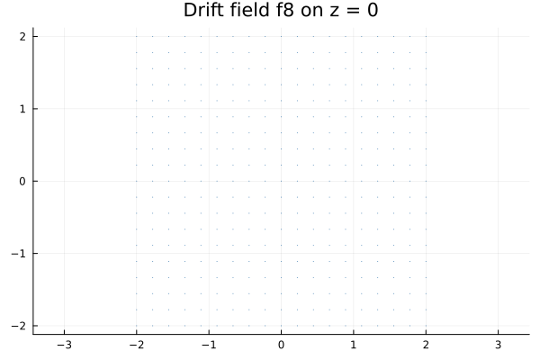
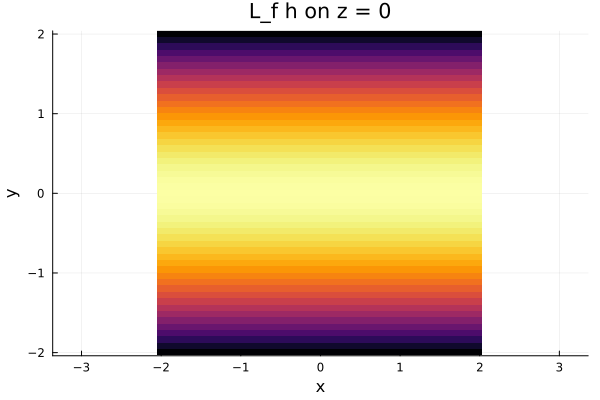
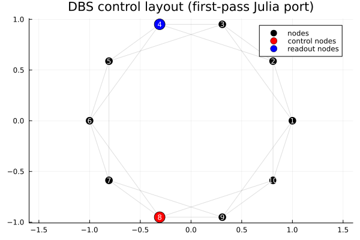
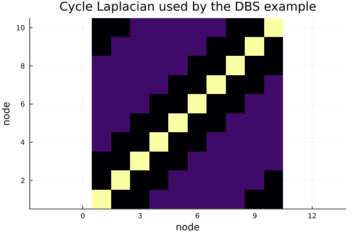
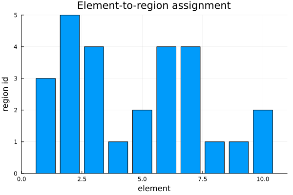
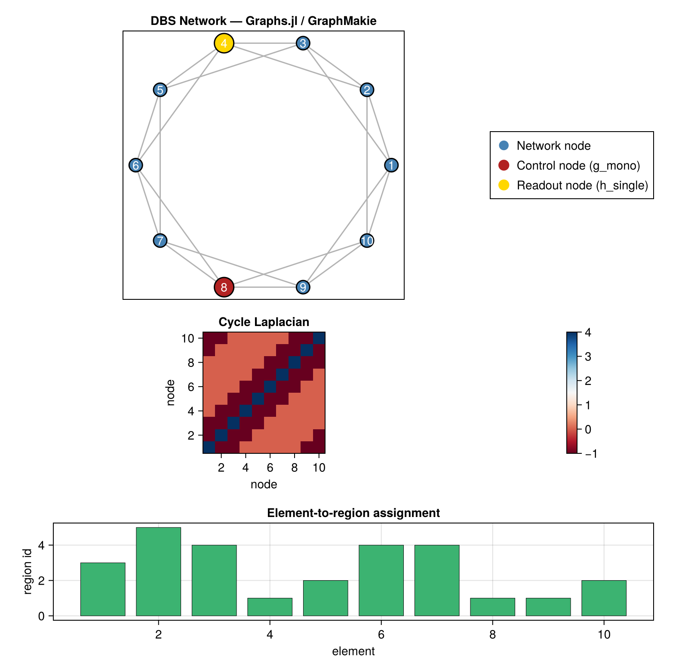
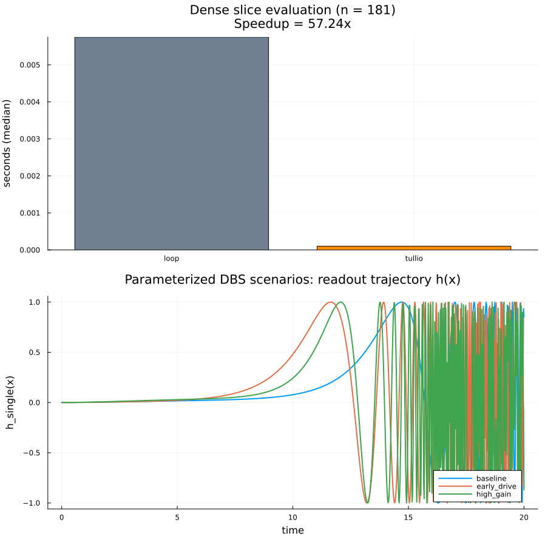

# LieControllability.jl

[](LICENSE)

A first-pass Julia port of [`autoLie`](https://github.com/virati/autoLie) focused on the core Lie derivative / Lie bracket workflow and a few representative control-affine dynamics.

> **Attribution** — The original `autoLie` Python library was written by [Vineet Tiruvadi](https://github.com/virati) and is released under the MIT License.  This Julia port inherits that license; see [LICENSE](LICENSE) for details.

---

## Background: Lie Controllability Theory

### Control-affine systems

Most physical systems of interest can be written in *control-affine* form:

```
ẋ = f(x) + Σ gᵢ(x) uᵢ
```

where `f` is the autonomous **drift** vector field, `gᵢ` are **control** vector fields, `uᵢ` are scalar inputs, and `x ∈ ℝⁿ` is the state.  Understanding whether the system can be steered between arbitrary states is the *controllability* problem.

### Lie derivatives

The **Lie derivative** of a scalar function `h` along a vector field `f` is defined as:

```
Lf h(x) = ∇h(x) · f(x)
```

For a vector field `g`, the iterated Lie derivative `Lf^k g` describes how `g` evolves under the flow of `f`.  Numerically, this is simply the directional derivative of one field with respect to another.

### Lie brackets

The **Lie bracket** of two vector fields `f` and `g` is:

```
[f, g](x) = (∂g/∂x) f(x) − (∂f/∂x) g(x)
```

It measures the infinitesimal rotation between the two flows.  Physically, if you follow `f`, then `g`, then `−f`, then `−g` for equal small times, the net displacement is approximately `[f, g]` scaled by the time squared.

### Controllability rank condition (Hermann–Nagano / Chow–Rashevskii)

A nonlinear control-affine system is **locally accessible** at `x₀` if the **involutive closure** (Lie algebra generated by iterated brackets of `f` and all `gᵢ`) spans ℝⁿ at `x₀`.  This is a generalisation of the classical Kalman rank condition to nonlinear settings:

```
rank( g₁, [f,g₁], [f,[f,g₁]], …, [gᵢ,gⱼ], … ) = n
```

The condition is satisfied generically (at almost every point) for most well-posed systems, but fails when control authority is structurally restricted — exactly the kind of situation that motivates the analysis in `autoLie`.

### Observability and measurement coupling

The dual question is *observability*: can the state be inferred from a measurement output `y = h(x)`?  The Lie derivative `Lf h` encodes how much information the drift dynamics contribute to the observed output, while `Lg h` encodes the measurement–control coupling.  When `Lg h = 0` the control input has no immediate effect on the measurement, which directly informs sensor/actuator placement strategies.

### Applications

| Domain | What Lie analysis tells you |
|---|---|
| **Adaptive DBS** (deep brain stimulation) | Optimal placement of recording and stimulation probes for maximal disease-state coverage; whether a given electrode configuration can observe/control a target symptom subspace. |
| **Network neuroscience** | Which nodes in a network are structurally controllable; rank of the controllability Gramian for reduced brain-network models. |
| **Robotics** | Kinematic controllability of underactuated manipulators and mobile robots (e.g., the car-parking problem is solved via the Lie bracket of steering and forward motion). |
| **Chemical processes** | Accessibility analysis of reaction networks with few actuated species. |
| **Power systems** | Nonlinear reachability for grid stabilisation controllers. |

---

## What is included

- `L_d` and `L_bracket` equivalents for numerical Lie analysis
- A lightweight `Operable` wrapper mirroring the original operator-composition idea
- Representative 3D dynamics from the Python codebase (`f1`, `f4`, `f8`, `f9`, `g1`, `h1`, `f_main`, etc.)
- A simplified DBS-style control system example
- Basic plotting helpers that save PNG figures from 2D slices of the 3D fields
- Dense-grid field evaluation via `Tullio.jl` (`slice_field_dense`, `slice_scalar_dense`)
- **`Graphs.jl` / `GraphMakie.jl`** network visualisation for richer DBS layout plots (see `examples/dbs_network_graphmakie.jl`)
- **`Symbolics.jl` symbolic codepath** — `sym_L_d`, `sym_L_bracket`, `sym_controllability_matrix`, and `sym_to_numeric` for exact closed-form Lie derivatives, brackets, and generated numeric functions (see `src/symbolic.jl`)
- Richer trajectory simulation (`simulate_trajectory`) and parameterized DBS presets (`dbs_scenario`, `DBSScenario`)

## What is intentionally *not* included yet

This first pass keeps the original design limitations intact:

- no GUI frontend
- no Mayavi dependency or full 3D interactive plotting
- no broad graph/network abstraction layer
- no attempt to generalize beyond the small set of original control-affine examples
- no refactor into a completely new API shape

---

## Quick start

```bash
# generate basic Lie derivative figures
julia --project=. examples/basic.jl

# generate DBS network figures (original Plots.jl version)
julia --project=. examples/dbs_network_ctrl.jl

# generate richer DBS network figure (Graphs.jl + GraphMakie.jl)
julia --project=. examples/dbs_network_graphmakie.jl

# benchmark dense-grid backends + compare parameterized DBS trajectories
julia --project=. examples/improvements_demo.jl

# run tests
julia --project=. -e 'using Pkg; Pkg.test()'
```

---

## Figures

### Drift vector field `f8` on the z = 0 plane

Each arrow shows the direction and (normalised) magnitude of the drift dynamics at that grid point.



---

### Lie derivative `Lf h` on the z = 0 plane

The scalar heatmap shows `Lf h(x) = ∇h · f` where `h(x) = 2x₁ + 3x₃`.  Bright regions indicate where the drift dynamics most strongly change the measured output; dark regions indicate invariant directions.



---

### DBS network node layout

Red: control node (actuated by `g_mono`).  Blue: readout node (observed by `h_single`).  Gray edges show the cycle-graph connectivity used to build the Laplacian.



---

### Cycle Laplacian

The graph Laplacian `L = D − A` for the 10-node regular cycle used as the network model.



---

### Element-to-region assignment

Randomly drawn assignment of the 10 network elements to 5 brain regions, used in the disease/control coupling analysis.



---

### Richer DBS network visualisation (Graphs.jl / GraphMakie.jl)

A single composite figure produced by `examples/dbs_network_graphmakie.jl`.  The top panel is a `graphplot!` of the 10-node cycle graph: **red** = control node (actuated by `g_mono`), **gold** = readout node (observed by `h_single`), **blue** = passive nodes.  The middle panel shows the full cycle Laplacian as a red-blue diverging heatmap, and the bottom panel repeats the element-to-region bar chart — all rendered with CairoMakie for crisp vector-quality output.



---

### Dense-grid acceleration + parameterized scenario trajectories

The top panel compares dense field-slice evaluation runtime on a `181 x 181` grid using the legacy nested-loop backend and the new `Tullio.jl` backend.  The bottom panel shows readout trajectories from three parameterized DBS presets (`:baseline`, `:early_drive`, `:high_gain`) integrated with the new `simulate_trajectory` API.



---

## Notes on design limitations preserved from `autoLie`

The Python repository is intentionally exploratory and numerically direct.  This port keeps that spirit by using explicit function arguments, a small catalog of sample fields, and grid-slice plotting rather than a new abstraction-heavy framework.

## Potential areas for improvement

- expand the control-affine example set beyond the original demo fields
- migrate the 3D figures to a modern interactive backend such as `Makie.jl`
- add a proper controllability rank test (Chow's theorem) over random sample points
- tighten the benchmark methodology in `examples/improvements_demo.jl` (e.g., warm-up pass + larger grid sweep) for more publication-style reporting
